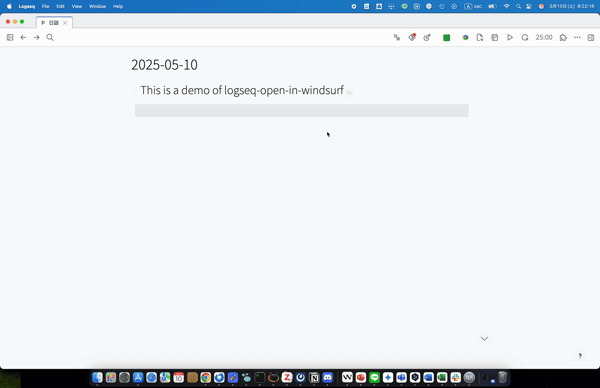

## Open Logseq in Windsurf

This plugin offers quick access of following in Windsurf 
- focused blocks or pages
- configuration files
- the graph folder




## Usage

Use the following keyboard shortcuts:
- `mod+shift+o`: Open graph
- `mod+o`: Open current page
- `mod+alt+o`: Open current block

You can also use the command palette to execute these commands.

Note: Logseq's `ctrl+d ctrl+a` shortcut opens the current page in the default app.

## Options
### Editor Options
This plugin is configured to work with Windsurf using the `windsurf://file/` URL scheme.

### Window options
By default, a new window will be opened. But sometimes it's preferable to avoid reopening a new window for each file. So several options are provided.

Choose where to open the specified file
- In an independent new window
- In the last focused window
- In the graph folder
- In the workspace (Experimental function. It only works when the file `<graph folder>/<graph_name>.code-workspace` exists)

> Right now the path of the file `<graph_name>.code-workspace` has to be put in the graph folder. And it's highly recommended to enable automatic saving on focus change. 
> ```json
>{
>	"folders": [
>		{
>			"path": "."
>		}
>	],
>	"settings": {
>		"files.autoSave": "onFocusChange", // recommended
>	}
>}
> ```

## Development

- Install dependencies with `npm install`
- Build the application using `npm run build` or `npm run watch`
- Load the plugin in the Logseq Desktop client using the `Load unpacked plugin` option.

## Acknowledgments

This plugin is a fork of [logseq-open-in-code](https://github.com/rebornix/logseq-open-in-code) by [rebornix](https://github.com/rebornix), modified to work with Windsurf instead of VS Code. Special thanks to the original author and contributors for creating this useful tool.
